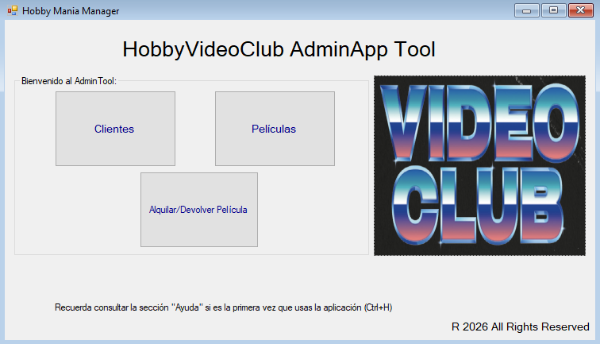
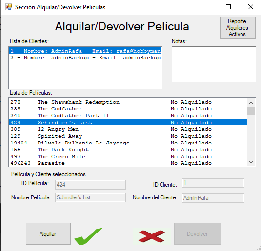
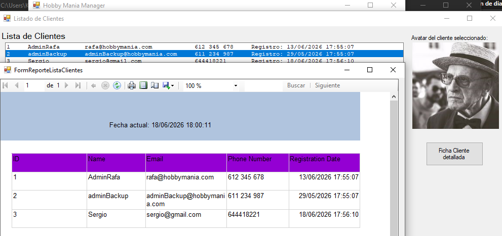
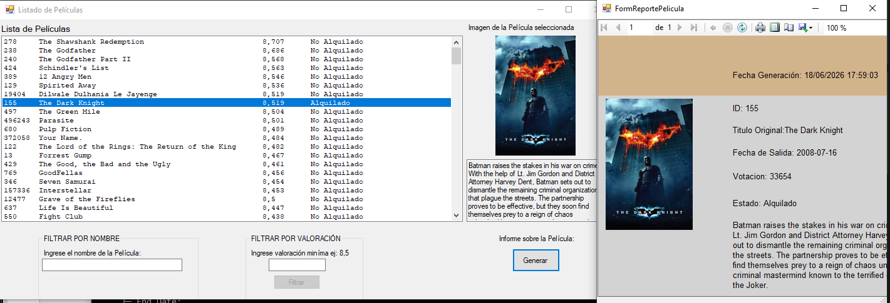
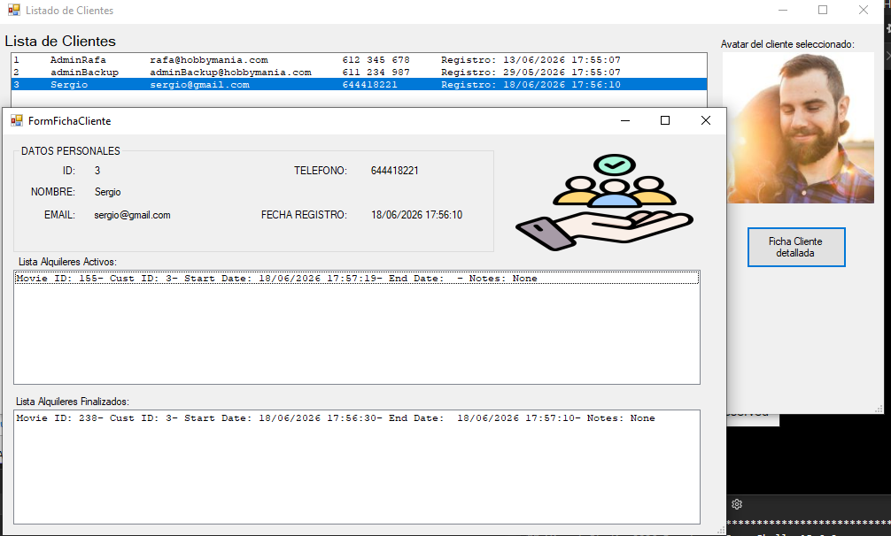
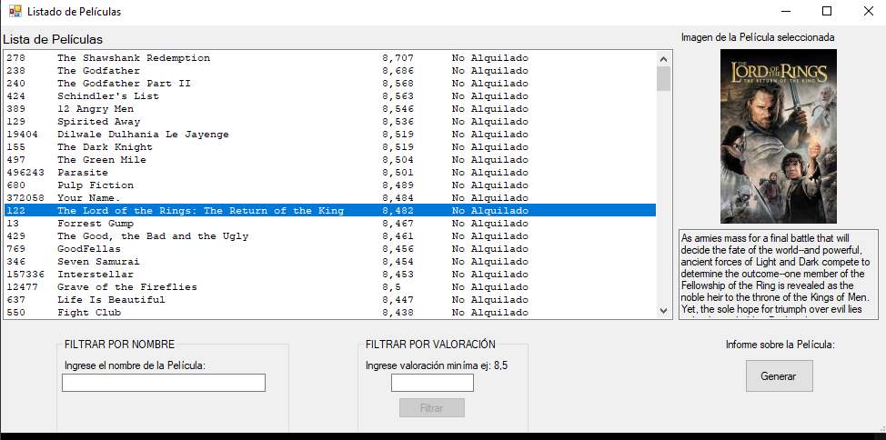

# Simulación de Videoclub en C#

Este proyecto es una aplicación de consola desarrollada en **C# con Visual Studio**, que simula el funcionamiento de un videoclub tradicional.

##  Descripción

El sistema permite gestionar el alquiler de películas mediante operaciones CRUD (Crear, Leer, Actualizar y Eliminar), así como la administración de usuarios y el control de alquileres y devoluciones.

Además, incluye la visualización de información detallada de cada película como portada, sinopsis y otros datos relevantes.

---

##  Funcionalidades principales

###  Gestión de usuarios
- Crear usuarios
- Listar usuarios
- Eliminar usuarios
- (Opcional) Editar usuarios

###  Gestión de películas
- Añadir nuevas películas
- Listar catálogo de películas
- Ver detalles (portada, sinopsis, etc.)
- Eliminar películas

###  Sistema de alquiler
- Alquilar películas
- Devolver películas
- Control de disponibilidad

###  Reportes
- Películas más alquiladas
- Historial de alquileres
- Estado de usuarios y actividad

---

##  Tecnologías utilizadas

- C#
- Visual Studio 2022 o superior
- Programación orientada a objetos (POO)
- Estructuras CRUD
- (Opcional) Archivos / bases de datos si aplica

---

## Vista del sistema

